# The discography seeder

A **temporary** feature. It exists to fill an empty DISCOGRAPHY from the
platforms the music is already on, is run once on the operator's machine, and
is deleted afterwards. §7 says how to remove it.

Typing a back catalogue in by hand is an evening's work and produces a
catalogue that disagrees with the stores in a dozen small ways — a date here,
a spelling there, an ISRC nobody copied. Everything needed is already public
and already keyed by identifiers built for exactly this.

---

## 1 · The pipeline

```mermaid
flowchart TD
    OP([Operator pastes keys]) --> SPOT

    subgraph SPINE["THE SPINE — the only source of identifiers"]
        SPOT["<b>SPOTIFY</b><br/>artist id → releases<br/>UPC per product<br/>ISRC per recording"]
    end

    SPOT -->|"18 UPCs"| APPLE
    SPOT -->|"57 ISRCs"| DEEZER
    SPOT -->|"57 ISRCs"| TIDAL
    SPOT -.->|"titles to compare against"| YT
    SPOT -.->|"titles to compare against"| SC

    subgraph EXACT["EXACT — joined by an identifier, so a link is right or absent"]
        APPLE["<b>APPLE MUSIC</b><br/>lookup?upc=<br/>keyless"]
        DEEZER["<b>DEEZER</b><br/>track/isrc:<br/>keyless"]
        TIDAL["<b>TIDAL</b><br/>filter[isrc]=<br/>client credentials"]
    end

    subgraph FUZZY["FUZZY — no identifier exists, only a title"]
        YT["<b>YOUTUBE</b><br/>Data API v3<br/>main + Topic channels"]
        SC["<b>SOUNDCLOUD</b><br/>oEmbed, keyless<br/>pasted track links"]
    end

    APPLE --> HARVEST
    DEEZER --> HARVEST
    TIDAL --> HARVEST

    YT --> TITLE{"exact title<br/>match?"}
    SC --> TITLE
    TITLE -->|yes| HARVEST
    TITLE -->|no| JEV

    subgraph ADJ["ADJUDICATION — @main/core/oracle, three staged questions"]
        JEV["<b>1 · identify</b><br/>which released recording<br/>is this, if any?"]
        JEV --> BRANCH{"matched<br/>a recording?"}
        BRANCH -->|no| NATURE["<b>2 · nature</b><br/>recording · promo<br/>mix · other"]
        BRANCH -->|yes| SAME["<b>3 · identity</b><br/>the same master, or<br/>a different edit?"]
    end

    NATURE --> BAND
    SAME --> BAND

    BAND{"probability"}
    BAND -->|"≥ 0.85"| HARVEST
    BAND -->|"≤ 0.15"| HARVEST
    BAND -->|"0.15 – 0.85"| FLAG(["flagged for the operator"])

    HARVEST[["<b>HARVEST</b> — held in memory<br/>no cache on disk, no writes"]]
    FLAG --> PLAN

    HARVEST --> PLAN
    CAT[("DISCOGRAPHY<br/>as it stands")] --> PLAN

    PLAN["<b>PLAN</b> · buildPlan()<br/>group exclusives by song"]
    PLAN --> REF

    REF{"is the group<br/>on SoundCloud?"}
    REF -->|"yes — SoundCloud holds the master"| MATCH
    REF -->|"no — YouTube only"| NOTREC(["not a record · link only"])
    NOTREC --> MATCH

    MATCH["match UPC → ISRC → URL → title<br/>mark each record create or update"]
    MATCH --> REVIEW

    subgraph CONFIRM["THE CONFIRM SCREEN — nothing has been written"]
        REVIEW["<b>REVIEW</b><br/>every record, link and track<br/>every flagged call, with its odds"]
        REVIEW --> EDIT{"operator<br/>changes<br/>something?"}
        EDIT -->|"overrule a call<br/>or untick a record"| REBUILD["rebuild from the<br/>cached harvest"]
        REBUILD --> REVIEW
    end

    EDIT -->|"looks right"| GATE{{"WRITE — confirmed"}}

    GATE --> APPLY["<b>APPLY</b> · through the ordinary<br/>DiscographyService<br/>additive · idempotent · deletes nothing"]
    APPLY --> CAT
    APPLY --> DONE([Outcome, counted])
    APPLY --> JOURNAL[/"<b>JOURNAL</b> · userData<br/>every id this run added"/]
    JOURNAL -.->|"UNDO — reverses exactly this,<br/>and nothing the operator did since"| CAT

    classDef spine fill:#1a171a,stroke:#d2a961,stroke-width:2px,color:#ddcfb2
    classDef exact fill:#131113,stroke:#976b30,color:#cdb994
    classDef fuzzy fill:#131113,stroke:#6f6656,color:#8a8071
    classDef gate fill:#24090a,stroke:#a32b23,stroke-width:2px,color:#ddcfb2
    classDef safe fill:#0a090b,stroke:#554e42,color:#8a8071

    class SPOT spine
    class APPLE,DEEZER,TIDAL exact
    class YT,SC,JEV,NATURE,SAME fuzzy
    class GATE,APPLY gate
    class HARVEST,PLAN,MATCH,REVIEW,REBUILD,JOURNAL safe
```



Read it in four bands. The top is **identifiers**, where a match cannot be
wrong. The next is **titles**, where it can, and where a model narrows a few
dozen judgement calls down to the handful worth a person's attention. Then the
**SoundCloud gate**, which is deterministic and settles most of what the model
found hardest — see §4a. The bottom is **the confirm gate**: a plan, a screen,
and one button. The only arrow into the catalogue is on the far side of it,
and the only arrow back out is the journal's.

---

## 2 · Why identifiers, and where they run out

**ISRC identifies a recording. UPC identifies a product.** They are the whole
reason this is tractable, and the distinction is load-bearing: a single and the
album carrying it share an ISRC and have different UPCs, so matching on ISRC
alone would fold one into the other and destroy a record. See
`ReleaseTrackSchema.releaseId` — album membership exists precisely so the two
can be related without being merged.

Four of the six platforms carry one of those identifiers, so their links are
exact and need no judgement. **SoundCloud and YouTube carry neither.** That is
the entire reason a model is involved: not to do the matching, but to answer
the handful of questions that identifiers cannot.

| Platform     | Joined by      | Key                | Certainty           |
| ------------ | -------------- | ------------------ | ------------------- |
| Spotify      | — (the source) | client credentials | —                   |
| Apple Music  | UPC            | none               | exact               |
| Deezer       | ISRC           | none               | exact               |
| TIDAL        | ISRC           | client credentials | exact               |
| YouTube      | title          | API key            | adjudicated         |
| SoundCloud   | title          | none (oEmbed)      | adjudicated         |
| Amazon Music | —              | —                  | **no route exists** |

---

## 3 · What was measured, not remembered

Every one of these differs from the documentation the plan was first written
against. They are recorded here so the next person does not rediscover them.

- **Spotify `/artists/{id}/albums` caps `limit` at 10.** Above that it answers
  `400 Invalid limit`. The documented maximum was 50.
- **Spotify's batch endpoints are gone for new apps.** `/albums?ids=` and
  `/tracks?ids=` answer `403 Forbidden`. Only the singular endpoints are open,
  so the harvest reads one record at a time.
- **Odesli is no longer keyless.** Every request answers
  `401 PUBLIC_API_ACCESS_DEPRECATED`. It was the plan's route to Apple and
  Amazon; UPC and ISRC lookups replaced it and are strictly better, being exact
  rather than an aggregator's guess from a URL.
- **SoundCloud API applications require Artist Pro.** The account is on Artist,
  so there is no key. The public oEmbed endpoint covers title and artwork.
- **TIDAL rate-limits aggressively** and answers 429 in bursts; the shared
  `request` helper backs off and the harvest completes.
- **Spotify answers a hard rate-limit with a `Retry-After` measured in
  hours.** 70571 seconds — 19h 36m — earned on 21 Sep 2026 by three full
  harvests in one afternoon. The transport obeyed it, which is
  indistinguishable from a hang: the log stops moving and nothing says why.
  `net.ts` now refuses any wait over two minutes and reports it instead, so
  the modal reads *"api.spotify.com is rate-limiting this application and
  asked to be left alone for 19h 29m"* in under a second.

  Three things follow from it. A single attempt has a 30-second deadline, so
  a socket that accepts and says nothing can no longer hang the run.
  `DISCARD` is never disabled — it was gated on "running", and a harvest
  asleep on that `Retry-After` counted as running, which left killing the
  application as the only way out of the modal. And portraits are skipped
  for artists already on the roster: they are the largest block of requests
  the harvest makes, their result would be discarded anyway, and on a second
  run the rung costs nothing.

  **Budget for it.** A cold harvest is about 140 Spotify calls. Three in an
  afternoon is enough to be locked out for a day.

## 4 · Two traps worth keeping in mind

**A name is not an artist.** Searching Spotify for "Candy Heist" returns a
second, unrelated act with the same name, and a release of theirs appeared on
_his_ YouTube channel's Releases tab. The harvest is keyed off his **artist
id**, never a name, and YouTube is allowed to contribute links but never to
mint a record.

**Two channels are not one.** `<Artist> - Topic` is auto-generated and holds an
Art Track per released recording; the channel he posts to holds promos and
Shorts. Putting the same id in both fields reads the same uploads twice and
finds no music at all — the harvester now refuses a duplicate channel.

---

## 4a · What counts as a record

Two rules the operator supplied, both of which the first pass got wrong.

**A promo is not a record.** Most of what a musician puts on YouTube is
_about_ the music rather than the music: teasers, studio clips, pre-save
announcements, festival footage, vlogs. The first pass filed all of it as
"not in the catalogue" and would therefore have minted a release for
`PRE-SAVE THIS TRACK AND MY EP "4x4"`. Anything the catalogue does not
contain is now asked what it _is_ — recording, promo, mix or other — and only
a recording becomes a record.

**SoundCloud is the reference for what is a real track.** Everything on
SoundCloud is also on YouTube; the reverse is not true. YouTube carries the
originals *and* everything else he posts — Shorts, teasers, festival clips,
"do I drop this?" — while the master of an unreleased track goes up on
SoundCloud. So SoundCloud is what says a recording exists, and YouTube is
where it is also published.

The rule that falls out: **a recording found only on YouTube is not a
record.** It can still contribute a link to a record the stores or SoundCloud
established, but it cannot mint one. This is deterministic, and it retires the
adjudicator's worst questions: asking a model whether `REMIXING A BOLLYWOOD
BANGER INTO TECH HOUSE #BOLLYTECH` is a recording or a promo is a coin-flip it
answered at 0.57, and asking whether the same song is on SoundCloud is a
lookup. Two Shorts became records in the first pass, and neither should have.

An explicit operator override still wins — otherwise the review screen would
be showing a choice that does nothing.

**An anime music video is the official video for its track.** `Candy Heist -
Over The Moon (Anime Music Video)` is not a separate work and not a promo; it
is the video for `Over The Moon`, which is a SoundCloud exclusive. Exclusives
are grouped across sources by title with the artist prefix and the format
words stripped, so that upload and the SoundCloud one become **one record
with two links** rather than two records. Four recordings in the first harvest
are exactly this shape.

## 5 · How it runs, for the operator

The seeder runs **on his machine, inside Candy Haven**, at
`/discography/seed`. There is one way in — a link in the DISCOGRAPHY masthead
— and it is deliberately not on the command rail, because a department you
delete next week should not look like one of the ten.

0. **Or load them from a file.** `Load from a file` opens a dialog, reads a
   `.env`, and fills the whole form — including the SoundCloud links, by
   following `SOUNDCLOUD_TRACK_LIST` relative to the env file. It maps the
   same variable names the terminal scripts used, so an existing
   `.env.seed` works unchanged. It reports what it did — *"9 fields, 19
   SoundCloud links, ignored JEV_MODEL, REMIX_BILLING"* — because a
   mistyped variable name is otherwise an empty field nobody notices until
   the harvest refuses.

   **The path never comes from the renderer.** The dialog is opened in the
   main process and only its result is read; a channel taking a path from
   the renderer would be a "read any file and parse it into key/value
   pairs" endpoint. The values *do* reach the form, which is the point —
   they are the same ones the operator would have typed, the secret fields
   are masked, and nothing is written to settings.

1. **Paste the credentials.** Four groups, one per browser tab. Only Spotify
   is required; every other source degrades on its own and says so on the
   proposal. They are held in the main process for the run, never written to
   settings, never returned across the bridge, and gone when the window
   closes. `SeedState` — the only thing the renderer can read — has no field
   that could carry one back.
2. **Harvest.** A modal opens and the run narrates itself: every call that
   goes out, what came back, and what each rung concluded — timestamped, one
   line each, colour-coded by which band of the pipeline produced it. It
   writes **nothing**.

   That is not decoration. A harvest is two minutes of somebody else's
   computers being asked questions, and a bar says only that it has not
   finished; the operator watching it is deciding whether to trust what comes
   out, and that judgement needs the working. It is also the only diagnostic
   there is — when TIDAL rate-limits or a channel handle resolves to somebody
   else's account, the line that says so is the difference between a fixable
   run and a mysterious one.

   **URLs are redacted before they reach the renderer.** A YouTube request
   carries its key in the query string and this pane is the likeliest thing
   in the feature to end up in a screenshot. See `redact` in `reporter.ts`.

   The modal does not close itself. When the reading finishes it becomes the
   **first of two gates** — `Continue` — and only then is the proposal
   revealed. The whole harvest is held in the service's memory, so the page
   can be left and come back to mid-run.
3. **Review — the confirm screen.** Every record it would raise or update,
   every platform link with *how it was matched*, every track with its ISRC,
   and every call the adjudicator was unsure about with its odds. Two things
   can be changed here:
   - **overrule a flagged call** — same recording, its own record, or not a
     record at all;
   - **untick a record** you do not want.

   Either rebuilds the whole plan from the cached harvest. That is not an
   optimisation: it is what guarantees the screen describes the writes, rather
   than describing the writes plus some adjustments.
4. **Write.** The second gate: one button, and a dialog that restates the
   totals before it does anything. **Additive and idempotent** — see §6.

Two deliberate presses stand between reading a public API and changing the
catalogue. The gap between 2 and 4 is the feature. A seeder that harvested and wrote in
one press would be a tool nobody could point at a catalogue that already has
records in it.

## 5a · Where the pieces live

| Piece | Path | Survives removal? |
| --- | --- | --- |
| Question/answer vocabulary, Jev client, staged pipeline | `src/main/core/oracle/` | **yes** — general |
| Retrying fetch, pool, rate limiter | `src/main/core/net.ts` | **yes** — general |
| Sources, adjudicator, planner, writer, service | `src/main/services/seed/` | no |
| Schemas | `src/shared/domain/seed.ts` | no |
| Page | `src/renderer/src/features/discography/seed/` | no |

The oracle and the net helpers were written for this and are deliberately
outside it. Neither knows anything about music: one answers typed questions
with probabilities, the other talks to rate-limited APIs. A second oracle — an
ordinary LLM wearing the same interface — is expected, and `ObjectPipeline`
never learns which one it is holding. See `src/main/core/oracle/index.ts`.

## 6 · The write is additive

The catalogue on his machine is not empty and must not be trampled.

- Matched on **UPC**, then **ISRC**, then a **platform URL**, then title *and*
  year. UPC is asked first on purpose: a single and the album carrying it
  share an ISRC and have different UPCs, so matching on the ISRC alone would
  fold one into the other and destroy a record.
- A record that is already there is _updated_ — links added, missing
  identifiers filled — **never replaced**. A field that holds something is
  left alone, because what is there was either typed by him or written by a
  previous run, and either way it is not this run's to overrule.
- A platform row with no stream address is *filled in*, which is exactly the
  state a release planned onto its stores sits in. A row that already points
  somewhere is untouched even when it disagrees with ours.
- Nothing is ever deleted. A record, track, link or credit the harvest knows
  nothing about is left exactly as it is.
- Running the seeder twice produces the same catalogue as running it once.
  "Run once" is always run twice in practice.
- Everything is written through `DiscographyService`'s own methods, not the
  repository — so every rule the catalogue enforces is enforced on the
  seeder's writes too, and deleting this folder leaves nothing behind.
- There is **no transaction**, deliberately. A run that writes fourteen
  records and reports two failures is useful; one that rolls back fourteen
  good records because of a malformed URL on the fifteenth is an evening
  wasted.
- Artists met along the way are resolved against the roster by name and
  created only when missing; the service already returns an existing record on
  a name collision, which is the behaviour a seeder wants.
- **A record is his only if he is on every track of it.** That is the test,
  and it is about the credits rather than about how the store filed it. It
  replaced `appears_on || more than ten tracks`, which got `Truths Collide`
  wrong: that is G.Roy's three-track EP — he is on the title track and
  G.Roy alone is on the other two — but Spotify files it under `single` and
  co-bills him as an album artist, so both halves of the old test passed it
  through as his own. Four of the eighteen records are external; the old
  test found three.
- **One recording, two products.** `Truths Collide` came out on that EP and
  was then licensed onto a 25-track compilation: one ISRC, two UPCs, two
  dates. The compilation's track row carries a note saying it is the same
  recording, and the EP's record note says where else it went.

  This *should* be `ReleaseTrackSchema.releaseId`, which exists for exactly
  this and would render as a proper link. It cannot be, because
  `assertOneRecording` refuses to point a row at anything that is not a
  single or a remix, and the home here is a three-track EP. That rule was a
  deliberate decision — "a running order collects singles and remixes" — and
  relaxing it from inside a temporary feature is not the seeder's call. If
  it is ever relaxed, this becomes a real link and the note comes out.
- Somebody else's record seeds **his track only** — not the other
  twenty-four, and not their artists. It is filed as what it actually is
  (a six-track remix EP is an EP, not a compilation), **billed to whoever
  released it** rather than to the people on his track, and carries a note
  on the record saying it is external and which track is his. His own
  credit is not lost by that billing: it sits on the track row, and
  `creditsForArtist` reports a track credit as a track credit — the
  truthful shape for a guest appearance.
- `Various Artists` is dropped rather than added to the roster. It is not a
  person, and the roster is who the practice actually works with.
- **Every recording on a multi-track record also becomes a record**, and the
  parent's row *points at* it through `ReleaseTrackSchema.releaseId` rather
  than restating its title and ISRC. The reason is findability: a track was
  not a record, so searching for `Menace` returned nothing and four of his
  own recordings had no entry. Eight singles come out of the three
  multi-track records. They carry no UPC — there is no second product —
  say on their face which record they were released as part of, and take
  that record's sleeve.

  The parent is written **after** its children, because naming one requires
  it to exist. And an ISRC now legitimately belongs to two records, so the
  ISRC index holds a list and prefers the candidate whose title matches:
  without that, a second run would decide the proposed `Menace` already
  exists as `4x4` and pour the single's fields into the EP.
- **Artists get their portraits.** Spotify's release and track artist
  objects are the simplified form — an id and a name — so a portrait needs
  its own call per artist, and the harvest makes one. Only somebody the run
  actually adds to the roster gets a picture: an artist already there keeps
  theirs, possibly chosen by hand, and a seeder is not entitled to replace
  it. A failure is silent, because an entry with no picture is the ordinary
  state of one typed in.
- **A promoted single does not leave the running order.** `4x4` is still one
  EP with four rows; each row now names the single it was promoted to
  instead of restating it, so the recording is stored once and reachable
  from both directions.

  This reverses an earlier decision in this document, and the reasoning is
  worth keeping. The first call was not to promote them, because the four
  recordings were never released on their own and a record per track
  invents products that do not exist. That is still true, and it is why a
  promoted single carries no UPC and says on its face that it came out as
  part of an EP. What outweighed it: the operator could not find his own
  recordings. A catalogue that is accurate about barcodes and useless for
  finding a song has optimised the wrong thing. Decided 21 Sep 2026.
- A remix of somebody else's song is billed to the original artist with Candy
  Heist credited as remixer: the store already bills it that way, so the
  harvest inherits it rather than deciding it.
- **Artwork follows the product, not the recording.** A track has no sleeve
  of its own and draws under its record's, so a track released with an
  album shows the album art without anything having to arrange it. A
  recording that was a single first keeps the single's own art, because
  each product brings its own image from the store. Where a record has no
  image, it borrows one from another product carrying the same recording —
  which is the operator's "if it doesn't exist then we reference the album
  art". Nothing in the present catalogue needs that: all eighteen store
  records already carry one.
- An exclusive takes **SoundCloud's artwork first**, and a YouTube thumbnail
  only where there is none. SoundCloud is where the master goes up, so its
  image is the one he chose for the track; a thumbnail is a frame of a
  video, right often enough to beat an empty sleeve and wrong often enough
  not to outrank the real thing.
- Artwork is fetched only when the record has none, and a failure to fetch it
  never fails a write.

## 6a · The run can be taken back

Every write is journalled to `userData/seed-journal.json`, and the seeder page
offers to reverse it.

**A journal, not a rule.** "Undo the seeding" sounds like it could be a query —
find everything that looks seeded and delete it — and that is the version that
eventually deletes something the operator typed. A record the seeder
*updated* is afterwards indistinguishable from one they filled in by hand,
because the whole point of §6 is that the seeder writes the fields a person
would. So the writer records what it did, per record, at the moment it did it:

| Recorded | Undone by |
| --- | --- |
| records it raised | deleting them |
| tracks it added to an existing record | removing exactly those track ids |
| distribution rows it created | removing exactly those row ids |
| addresses it filled on rows that existed | clearing the address, keeping the row |
| fields that were empty and it filled | clearing those fields |
| artwork it fetched | clearing the artwork |
| artists it put on the roster | removing them |

Everything else survives: a track the operator added to a seeded record
afterwards, a link they pasted, a label they corrected, and every record the
run never touched. A record already deleted by hand is skipped rather than
reported as a failure.

The journal is written **before** the outcome is reported, so a run can never
end up written-but-unundoable without a loud error. `Keep it — stop offering`
drops the journal for an operator happy with the result, because a permanent
undo button is a standing invitation to an accident.

## 6b · What the seeder cannot fill in

Every track it writes has **no project and no master**, and that is not a
gap it can close. A project is a folder of work in the ARCHIVE, and most of
a back catalogue predates this application — there is no project for a
record from 2018 and there never will be one.

That exposed a refusal in DISCOGRAPHY itself rather than in the seeder:
`setTrackMaster` insisted the file be one of the linked project's bounces,
so a projectless track could not name a master at all. Since `publish`
skips a track with no master, the field was unreachable for exactly the
records that most needed it. A track with no project can now name the file
directly — `LINK A MASTER` beside `LINK A PROJECT` in the running order —
and the guards that remain are the ones that matter: it has to be an audio
format and it has to be there. Nothing is copied or moved, exactly as a
project's bounce is referenced where it sits.

Where there *is* a project, its bounces are still the only candidates. That
route keeps the shipped file beside the session that made it, which is the
whole reason it exists.

## 7 · Removing it

By design this is one folder, one route and one link:

1. Delete `src/main/services/seed/` and `src/shared/domain/seed.ts`.
2. Delete the `seed:*` block from `src/shared/ipc/contract.ts`, the handlers
   in `src/main/ipc/register-handlers.ts`, the `seed` block in
   `src/preload/index.ts` and the `readonly seed` block in
   `src/shared/ipc/api.ts`. Each is marked with a `THE SEEDER · temporary`
   comment.
3. Delete `SeedService` from `src/main/services/container.ts` — three marked
   lines.
4. Delete `src/renderer/src/features/discography/seed/`, its route in
   `src/renderer/src/app/router.tsx`, and the `.seedLink` in DISCOGRAPHY's
   page and stylesheet.
5. Delete `src/renderer/src/hooks/useSeed.ts`.
6. Delete `scripts/seed/`, `.seed-cache/`, `.env.seed` and
   `info/soundcloud-tracks.txt`.
7. Delete `userData/seed-journal.json` if one is left behind.

**Keep** `src/main/core/oracle/` and `src/main/core/net.ts`. Nothing about
them is specific to this, and the next feature that needs a probability or a
rate-limited API wants them.

Nothing else in the application depends on any of it. The records it wrote are
ordinary DISCOGRAPHY records and stay behind.

---

## 8 · What the first harvest found

Run 21 Sep 2026 against the real catalogue, for scale:

```
Spotify      18 records · 57 recordings · 57 ISRCs · 18 UPCs
Apple        18/18 records
TIDAL        57/57 recordings
Deezer       50/57 recordings      (the 7 are inside a foreign compilation)
YouTube      10 art tracks + 23 uploads on the main channel
SoundCloud   19 tracks
Amazon       no route
```

What the proposal came to:

```
17  released records, 32 recordings
 1  compilation appearance, his track only
13  exclusive records, folded from 17 uploads
 8  links added to records that already exist
12  uploads dropped as promo, mix or other
21  decisions flagged for review before anything is written
```

The case that justifies the adjudicator: `YKWIL (Candy Heist Remix)` on Spotify
and `You Know What I Like (Candy Heist Remix)` on SoundCloud are one recording
under two names, and no string comparison will ever say so.
