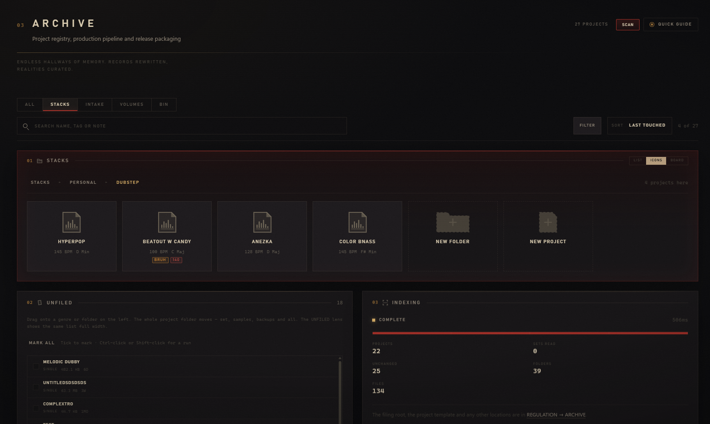

# Guide captures

Screenshots drawn by the CATECHISM — both the quick-guide carousels and the
reference chapters. Referenced from Markdown by **filename alone**:

    

`lib/guide-assets.ts` globs this directory, so a capture dropped in here is
available the moment it exists. No import, no registry entry, no code change.

A name with no file renders as a captioned `CAPTURE PENDING` plate rather than a
broken image, which means a chapter can be written before its screenshot is
taken — and the plates double as the outstanding shot list.

The full shot list — every filename, what to capture, and which chapter uses
it — is in [SCREENSHOTS.md](SCREENSHOTS.md). It is generated from the Markdown,
so it cannot drift from what the documentation actually references.

## Capture specification

|          |                       |
| -------- | --------------------- |
| Format   | PNG                   |
| Window   | 1600 x 1000           |
| Accent   | crimson (the default) |
| Motion   | full                  |
| UI scale | 1.0                   |

Full-console shots include the title bar and the navigation rail. Detail shots
are cropped tight to the panel or dialog, with no desktop behind them.

Capture with real-looking data on screen — an empty state teaches nothing,
except where a chapter is specifically documenting one (`archive-05-setup.png`,
`dispatch-02-door.png`).

Scrub secrets before capturing `regulation-03-integrations.png`: client ids,
tokens and the board password.

## Naming

`<scope>-<nn>-<topic>.png`, kebab-case. The scope is the department, `welcome`
for the orientation tour, or `overlay-<name>` for a broadcast source.
